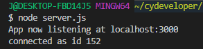
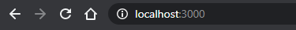
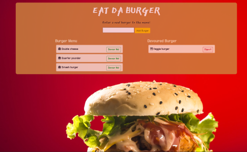
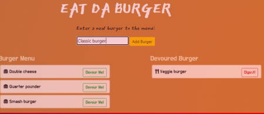
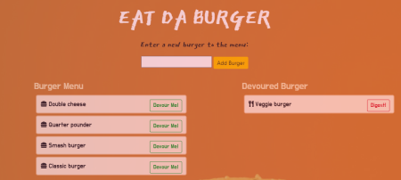
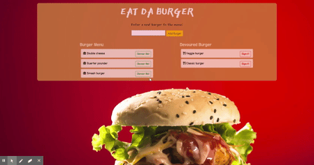
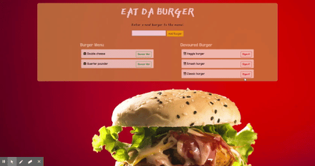

# EAT DA BURGER

## Description 

EAT DA BURGER is a burger logger application with MySql, Node, Express, Handlebars and ORM.  It allows user to input/add a new entry to the burger menu, change the state of the item/burger and then delete a burger from the list.  In this app, we reffer the change of state with the key word __Devour Me__ and to delete with __Digest__.  As user add a new entry to the menu, the  list will appear on the left side of the page and a button _Devour Me_ will be displayed.  Then when user click _Devour Me_ button, the selected item/burger will appear to the right of the page with a button _Digest_ available for the user to remove/delete the burger.

## Installation
### Steps required running the app through __local server__:

In the terminal mode, user must first run __npm install__ to have its package dependecies. Then, user can run the __server.js__ file in Node environment by running __node server.js__. \
 \
Then after sucessfull connection, user need to type _localhost:3000_ in the browser to access index.html. \
 

### Link to access the app in __Heroku__:

This application is also hosted in Heroku web server. \
Click this link:  https://sheltered-anchorage-23068.herokuapp.com/ to access this application.

## Usage 
### __Main Page__: index.html
Using either method, user will be navigated to the main __EAT DA BURGER__ page. \
In this page, user can add, change burger state and delete a burger from the list. \

### __Adding__ a new burger menu: User can add a new burger menu to the list. 
As user click the __Add Burger__ button, the new menu will appear on the left side of the page as the __Burger Menu__. \
 \
The new added item/burger is displayed under Burger Menu with _Devour Me_ button. \

### __Toggling__ from __Burger Menu__ to __Devoured Burger__: When user click _Devour Me_ button, the selected item will appear on the right of the page as __Devoured Burger__ \
Demo preview: \

### __To delete__: User can delete a selected burger from __Devoured Burger__ list by clicking _Digest_ button. \
Demo preview: \

## CONTRIBUTOR
* Background image provided by: <a href="https://pixabay.com/users/fonok-12260375/?utm_source=link-attribution&amp;utm_medium=referral&amp;utm_campaign=image&amp;utm_content=4385386">Iftekhar Uddin Emon</a> from <a href="https://pixabay.com/?utm_source=link-attribution&amp;utm_medium=referral&amp;utm_campaign=image&amp;utm_content=4385386">Pixabay</a>

## MAINTAINER 
This is an individual assignment maintained by Carolina Yoedhana.
* GitHub repo: https://github.com/CarolinaYo/eatdabuger-mvc.git
